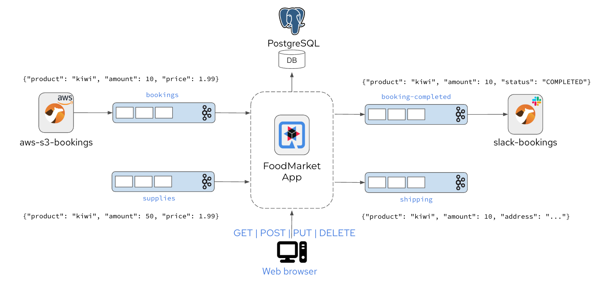
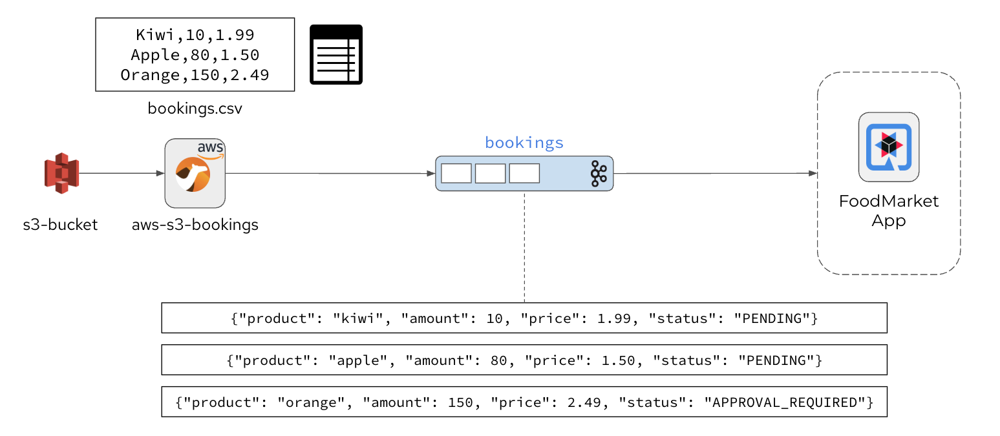
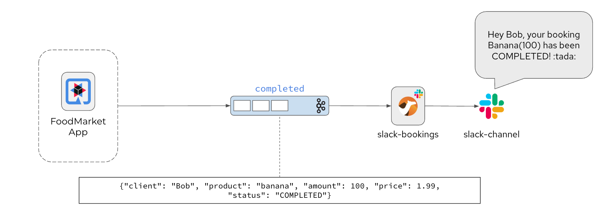

# Camel Integration Demo

This project uses [Apache Camel](https://apache.camel.org) to implement integration patterns on a Quarkus sample application. 

## Objectives

The project uses Apache Camel to integrate the Quarkus application with 3rd party services such as AWS S3 and Slack. 
Camel performs patterns such as content based routing, message transformation, content enrichment, splitting of messages and many more.

If you want to learn more about Apache Camel, please visit its website: [https://apache.camel.org](https://apache.camel.org).
If you want to learn more about Quarkus, please visit its website: [https://quarkus.io/](https://quarkus.io/).

## Quarkus sample application

The Quarkus sample demo application is a food market event-driven application that listens for incoming events of type `booking` and `supply`.



Users are able to add booking events. Each of them references a product and gives an amount as well as an accepted price in a simple Json object structure.

```json
{ "client": "citrus-test", "product": "Pineapple", "amount":  100, "price":  0.99 }
```

At the same time suppliers may add their individual supply events that again reference a product with an amount and a selling price.

The Quarkus application consumes both event types and as soon as bookings and supplies do match in all criteria the food market application will produce booking-completed and shipping events as a result.

All events are produced and consumed with Kafka event streams.
The domain model objects with their individual status are stored in a PostgreSQL database.

## Camel integrations

The demo integrates the Food Market application with 3rd party services such as AWS S3 and Slack.

_AWS S3 bookings source_



_Slack completed bookings sink_




## Stage #0: Preparations

### Deployments

### Database

### Kafka cluster and topics

### Secrets and ConfigMaps

_AWS S3 credentials_
```shell
oc apply -f 00_infra/secrets/aws-s3-credentials.yaml
```

_Slack credentials_
```shell
oc apply -f 00_infra/secrets/slack-credentials.yaml
```

### Permissions and roles

Allow Camel to read secrets and credentials:

```shell
oc adm policy add-role-to-user view system:serviceaccount:camel-integration-day:default
oc secrets link default aws-s3-credentials --for=mount
oc secrets link default slack-credentials --for=mount
```

Check mountable secrets:

```shell
oc describe serviceaccount default

Name:                default
Namespace:           camel-integration-day
Labels:              <none>
Annotations:         openshift.io/internal-registry-pull-secret-ref: default-dockercfg-vn26r
Image pull secrets:  default-dockercfg-vn26r
Mountable secrets:   default-dockercfg-vn26r
                     aws-s3-credentials
                     slack-credentials
Tokens:              <none>
Events:              <none>
```

Allow Pipelines to create Deployments and run privileged tasks (e.g. Buildah image build)

```shell
oc adm policy add-scc-to-user privileged system:serviceaccount:camel-integration-day:pipeline
oc adm policy add-role-to-user edit system:serviceaccount:camel-integration-day:pipeline
```

## Stage #1: Prototyping the Camel routes

## Stage #2: Project export

## Stage #3: CI/CD Pipeline

## Stage #4: Deploy to Kubernetes

## Stage #5: Observability & Testing

## Running the application in dev mode

You can run your application in dev mode that enables live coding/testing using:

```shell script
./mvnw compile quarkus:dev
```

> **_NOTE:_**  Quarkus ships with a Dev UI, which is available in dev mode only at http://localhost:8080/q/dev/.
